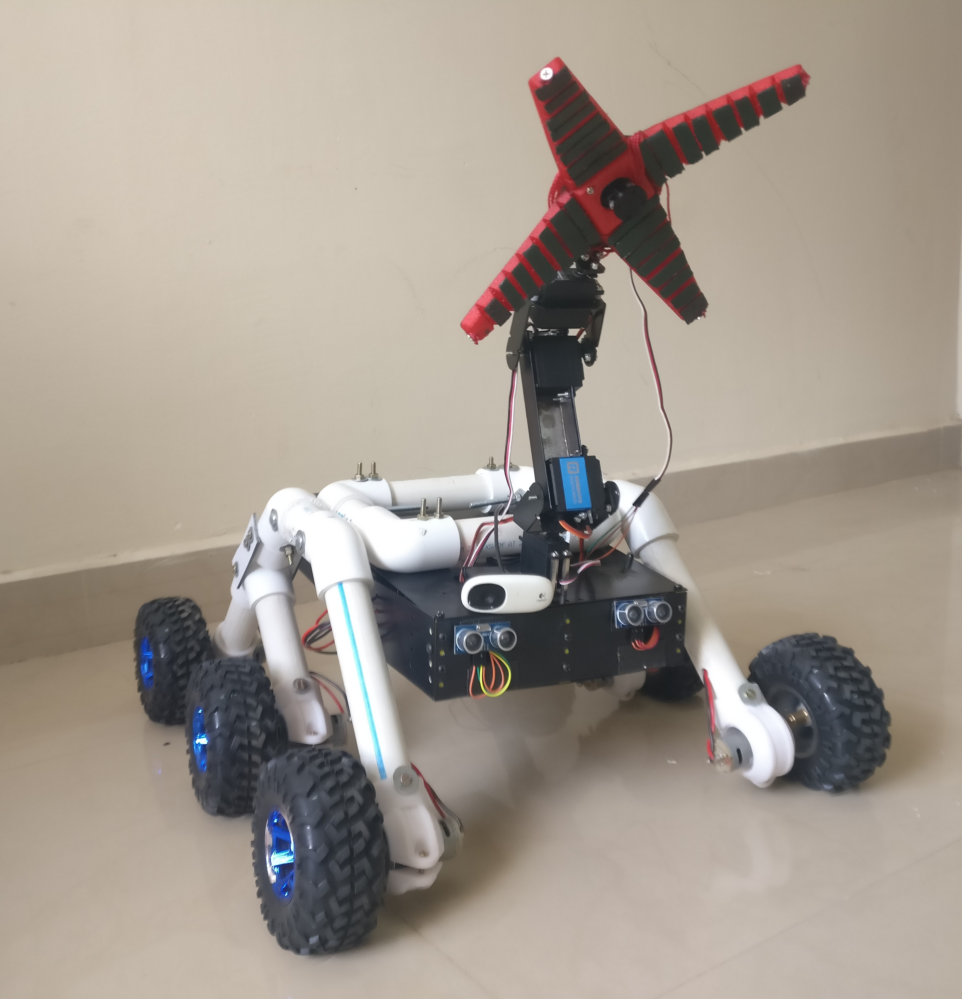
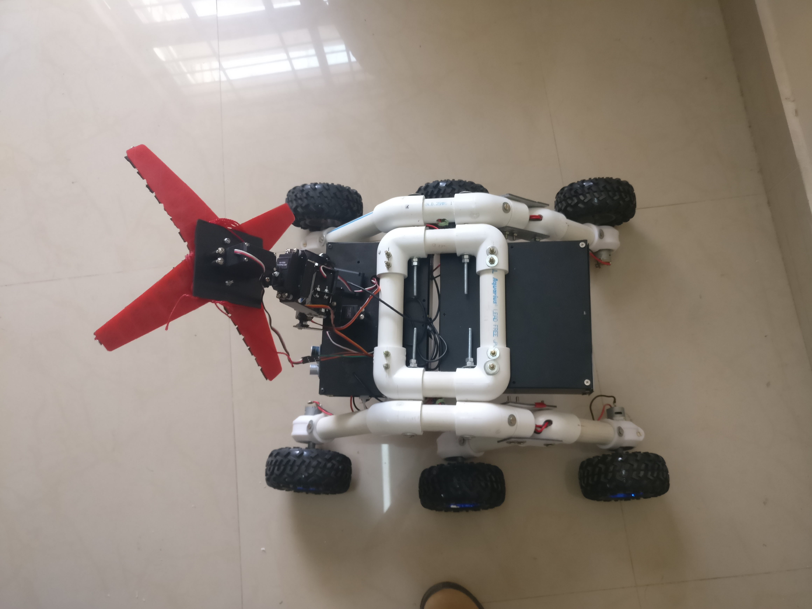

# 🌍 Smart Garbage Collection System

## 📜 Overview
This project showcases the **research, design, and implementation** of a **Smart Garbage Collection System** powered by autonomous robots. The system addresses modern-day waste management challenges by employing a fleet of robots capable of automatically collecting and segregating garbage in public spaces. The solution leverages **AI, object classification,** and **autonomous navigation** to enhance efficiency and sustainability in waste management.

## 🚀 Key Features
- **Autonomous Waste Collection**: Robots autonomously navigate and collect garbage from public areas.
- **Object Classification**: Integrated AI for recognizing and segregating different types of waste.
- **Real-Time Navigation**: Advanced autonomous navigation module to avoid obstacles and operate efficiently.

## 🛠️ System Implementation
This repository includes:
- **Robot Control System**: The core module managing the robot’s movements and tasks.
- **Object Classifier**: AI module for classifying waste into recyclable and non-recyclable categories.
- **Autonomous Navigation**: Module to enable real-time, obstacle-free navigation in dynamic environments.

## 🧑‍💻 How to Use
This repository is a valuable resource for:
- **Researchers & Developers**: Dive into the world of autonomous robots and intelligent waste management systems.
- **Students & Educators**: Gain insights into the intersection of **robotics**, **AI**, and **sustainable technologies**.

## 📸 Robot Images
Explore our autonomous robot in action:

## 🛠️ System Design
### 🔄 Sequence Diagram
The sequence diagram provides a visual breakdown of the robot's operational flow from waste detection to collection and segregation.

## 🤝 Contributions
We welcome contributions to this project. You can contribute by:
- Reporting bugs or suggesting improvements.
- Adding new features or enhancements.
- Providing feedback on documentation or user experience.

## 📜 License
This project is open-sourced under the [MIT License](LICENSE).

## ✉️ Contact
For questions, feedback, or collaboration inquiries, please reach out to **Nihal Nihalani** at:  
📧 [nihal.nihalani@gmail.com](mailto:nihal.nihalani@gmail.com)
