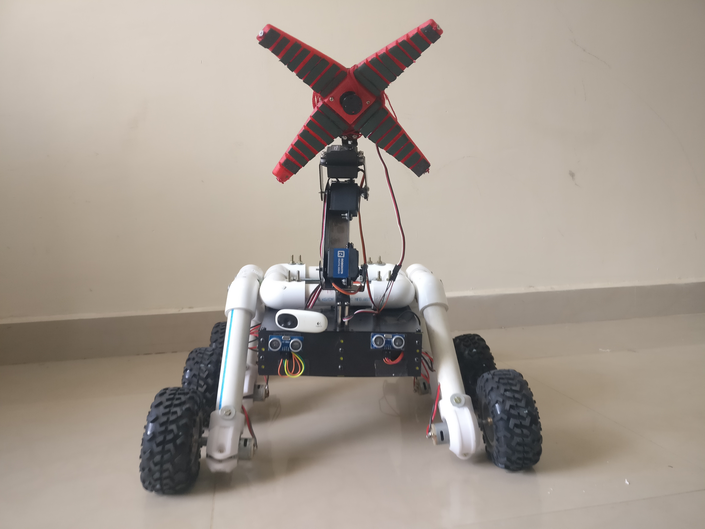

# Smart-Garbage-Collection

## Description
This repository encompasses the research, design, and implementation of a Smart Garbage Collection System utilizing autonomous robots. The primary objective of this project is to tackle the challenges associated with waste management by creating a system capable of automatically collecting and segregating garbage in public areas.

## Implementation: Code for the robot's control system, object classifier, and autonomous navigation module.

## Usage
This repository serves as a valuable reference for:
Researchers and developers engaged in autonomous robots and waste management systems.
Students and educators interested in the realm of robotics and artificial intelligence.

# Robot images

# Sequence Diagram

## Contributing
Contributions to this repository are encouraged. You can contribute by:
Reporting bugs or suggesting improvements to the code.
Adding new features or enhancements to the system.
Providing feedback on the documentation or user interface.
## License
This repository is licensed under the MIT License.
## Contact
For any questions or inquiries, please contact nihal.nihalani@gmail.com."
